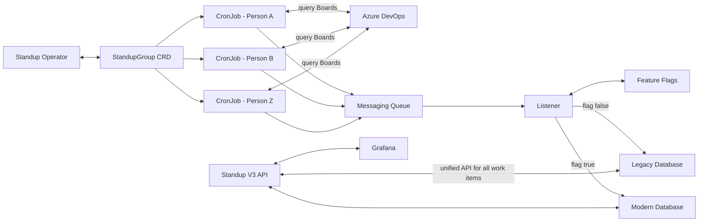

# standup-as-a-service

Inside joke for work.

```mermaid
flowchart LR
    operator[Standup Operator]<-->crd[StandupGroup CRD]
    crd-->cron1
    crd-->cron2
    crd-->cron3
    cron1[CronJob - Person A]<--query Boards-->ado[Azure DevOps]
    cron2[CronJob - Person B]<--query Boards-->ado
    cron3[CronJob - Person Z]<--query Boards-->ado
    cron1-->rmq[Messaging Queue]
    cron2-->rmq
    cron3-->rmq
    rmq-->lsnr[Listener]
    lsnr<-->flag[Feature Flags]
    lsnr--flag false-->dbl[Legacy Database]
    lsnr--flag true-->dbm[Modern Database]
    ws[Standup V3 API]<--unified API for all work items---->dbl
    ws<-->dbm
    ws<-->grafana[Grafana]
```

